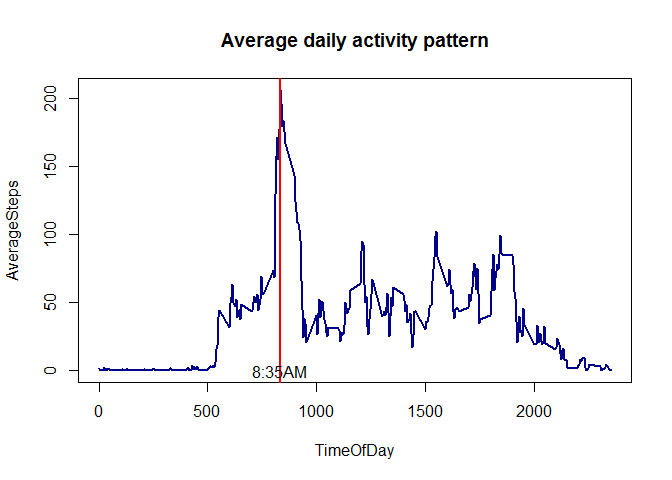

# Reproducible Research: Peer Assessment 1
## Introduction
This assignment uses the data from a personal activity monitoring device. The device collects data at 5 minute intervals throughout the day. The data consists of two months of data from an anonymous individual collected during the months of October and November, 2012 and include the number of steps taken in 5 minute intervals each day. The steps in this projects presents the principles of Reproducible research by creating R markdown documents which consists of all the R codes used for the analysis of the data along with the results of the analysis.


## Loading and preprocessing the data
The data for this assignment can be downloaded from the course web site:
Dataset: Activity monitoring data [52K]
The variables included in this dataset are:
steps: Number of steps taking in a 5-minute interval (missing values are coded as NA)
date: The date on which the measurement was taken in YYYY-MM-DD format
interval: Identifier for the 5-minute interval in which measurement was taken
The dataset is stored in a comma-separated-value (CSV) file and there are a total of 17,568 observations in this dataset.

####Following R code downloads data and unzips and load the csv file


```r
setwd("F:\\Cousera\\DataScience\\ReproducibleResearch\\assignment\\")
if(!file.exists("data")) {
  dir.create("data")
}
  
fileUrl <- "http://d396qusza40orc.cloudfront.net/repdata%2Fdata%2Factivity.zip"
download.file(fileUrl,destfile = "./data/activity.zip")

ActivityData <- read.csv(unz("./data/activity.zip", "activity.csv"), header=TRUE,sep=",",
				colClasses = c('integer','Date','integer'))
```

####Explore the data and see summary information about the data

```r
str(ActivityData)
```

```
## 'data.frame':	17568 obs. of  3 variables:
##  $ steps   : int  NA NA NA NA NA NA NA NA NA NA ...
##  $ date    : Date, format: "2012-10-01" "2012-10-01" ...
##  $ interval: int  0 5 10 15 20 25 30 35 40 45 ...
```

```r
summary(ActivityData)
```

```
##      steps             date               interval     
##  Min.   :  0.00   Min.   :2012-10-01   Min.   :   0.0  
##  1st Qu.:  0.00   1st Qu.:2012-10-16   1st Qu.: 588.8  
##  Median :  0.00   Median :2012-10-31   Median :1177.5  
##  Mean   : 37.38   Mean   :2012-10-31   Mean   :1177.5  
##  3rd Qu.: 12.00   3rd Qu.:2012-11-15   3rd Qu.:1766.2  
##  Max.   :806.00   Max.   :2012-11-30   Max.   :2355.0  
##  NA's   :2304
```

## What is mean total number of steps taken per day?
To calculate the total steps taken per day we need to transform and aggregate the data. We are also removing any NULL data


```r
steps_per_day <- as.data.frame.table(tapply(ActivityData$steps, ActivityData$date, FUN = sum, na.rm = TRUE))
colnames(steps_per_day) <- c("date","steps")
head(steps_per_day)
```

```
##         date steps
## 1 2012-10-01     0
## 2 2012-10-02   126
## 3 2012-10-03 11352
## 4 2012-10-04 12116
## 5 2012-10-05 13294
## 6 2012-10-06 15420
```

####Histogram of the number of steps taken on a day looks like this

```r
library(ggplot2) 
```

```
## Warning: package 'ggplot2' was built under R version 3.2.3
```

```r
ggplot(steps_per_day, aes(x = steps)) + 
       geom_histogram(fill = "light blue", binwidth = 1000) + 
        labs(title="Histogram of Steps Taken per Day", 
             x = "Number of Steps per Day", y = "Frequency") + theme_bw() 
```


####Calculation of the mean and median of the total number of steps taken per day

```r
steps_mean   <- mean(steps_per_day$steps)
steps_median <- median(steps_per_day$steps)
```

Mean steps taken per day : 9354.2295082

Median steps taken per day : 10395


## What is the average daily activity pattern?
To calculate the average daily pattern of the number of steps taken across all the days in data set we need to transform the data by 
summing all steps taken in each 5 minute interval. The data is prepared as follows

```r
avg_steps_by_inerval <- aggregate(x = list(Avgsteps = ActivityData$steps), by = list(interval = ActivityData$interval),FUN = mean, na.rm = TRUE)
MaxSteps<-max(avg_steps_by_inerval$Avgsteps)
MaxActivityTime <- subset(avg_steps_by_inerval, Avgsteps==MaxSteps, select=c(interval))
```
Maximum number of steps taken is 206.1698113 and the time of the day it was taken is 835

Please see the Vertical red line indicating the maximum average number in the plot below with the specified time of the day indicating the most active period of the day

```r
plot(x=avg_steps_by_inerval$interval,y=avg_steps_by_inerval$Avgsteps,type ="l",col ="darkblue", main="Average daily activity pattern",
     xlab ="TimeOfDay", ylab ="AverageSteps", lty =1, pch =16, lwd =2)
abline(v=MaxActivityTime, col ="red", lty = 1, lwd =2)
text(MaxActivityTime,0,"8:35AM")
```



## Imputing missing values
There are many intervals where there are missing values (coded as NA). The presence of missing days may be problematic. Summary of missing values

```r
missing <- is.na(ActivityData$steps)
table(missing)
```

```
## missing
## FALSE  TRUE 
## 15264  2304
```

```r
summary(ActivityData)
```

```
##      steps             date               interval     
##  Min.   :  0.00   Min.   :2012-10-01   Min.   :   0.0  
##  1st Qu.:  0.00   1st Qu.:2012-10-16   1st Qu.: 588.8  
##  Median :  0.00   Median :2012-10-31   Median :1177.5  
##  Mean   : 37.38   Mean   :2012-10-31   Mean   :1177.5  
##  3rd Qu.: 12.00   3rd Qu.:2012-11-15   3rd Qu.:1766.2  
##  Max.   :806.00   Max.   :2012-11-30   Max.   :2355.0  
##  NA's   :2304
```
All of the missing values can be filled in with mean value for that 5-minute interval. Following codes does that. 


```r
ActivityData_Corrected <- merge(ActivityData, avg_steps_by_inerval, by="interval", all.x=TRUE)
ListOfNA<-which(is.na(ActivityData_Corrected$steps))
for (i in ListOfNA)
    {
      ActivityData_Corrected$steps[i] =ActivityData_Corrected$Avgsteps[i]  
    }
missing <- is.na(ActivityData_Corrected$steps)
```

The summery of missing values in corrected table is below. The summary stats is different as seen below if we compare before and after value.


```r
table(missing) 
```

```
## missing
## FALSE 
## 17568
```

```r
summary(ActivityData_Corrected) 
```

```
##     interval          steps             date               Avgsteps      
##  Min.   :   0.0   Min.   :  0.00   Min.   :2012-10-01   Min.   :  0.000  
##  1st Qu.: 588.8   1st Qu.:  0.00   1st Qu.:2012-10-16   1st Qu.:  2.486  
##  Median :1177.5   Median :  0.00   Median :2012-10-31   Median : 34.113  
##  Mean   :1177.5   Mean   : 37.38   Mean   :2012-10-31   Mean   : 37.383  
##  3rd Qu.:1766.2   3rd Qu.: 27.00   3rd Qu.:2012-11-15   3rd Qu.: 52.835  
##  Max.   :2355.0   Max.   :806.00   Max.   :2012-11-30   Max.   :206.170
```
Now, using the filled data set, lets make a histogram of the total number of steps taken each day and calculate the mean and median total number of steps.


```r
steps_per_day_1 <- as.data.frame.table(tapply(ActivityData_Corrected$steps, ActivityData_Corrected$date, FUN = sum, na.rm = TRUE))
colnames(steps_per_day_1) <- c("date","steps")
```
Merge two data sets before and after correction for plotting 2 data sets together

```r
steps_per_day$WhichOne <-'Before Correction'
steps_per_day_1$WhichOne <-'After Correction'
steps_per_day_Combined <-rbind(steps_per_day, steps_per_day_1)
```

####Comparative Histogram of the number of steps taken on a day looks like this

```r
library(ggplot2) 
ggplot(steps_per_day_Combined, aes(x = steps, fill=WhichOne)) + 
       geom_histogram(color = "black", binwidth = 1000) + theme(legend.position="top") +
	   facet_grid(WhichOne ~ .) +
        labs(title="Histogram of Steps Taken per Day", 
             x = "Number of Steps per Day", y = "Frequency")  
```


####Calculation of the mean and median of the total number of steps taken per day before and after correction


```r
MeanCompare <-aggregate(steps_per_day_Combined$steps, by=list(steps_per_day_Combined$WhichOne), FUN=mean)
MedianCompare <-aggregate(steps_per_day_Combined$steps, by=list(steps_per_day_Combined$WhichOne), FUN=median)
print(MeanCompare)
```

```
##             Group.1        x
## 1  After Correction 10766.19
## 2 Before Correction  9354.23
```

```r
print(MedianCompare)
```

```
##             Group.1        x
## 1  After Correction 10766.19
## 2 Before Correction 10395.00
```
Mean and median values are higher after correction of missing data. The reason is that in the original data, there are some days with steps values NA for any interval. The total number of steps taken in such days are set to 0s by default. However, after replacing missing steps values with the mean steps of associated interval value, these 0 values are removed from the histogram of total number of steps taken each day.

##Are there differences in activity patterns between weekdays and weekends?
 We do not have weekdays or weekend category in data so lets create weekdays or weekend category

```r
 WeekDay_OR_end <- function(date) {
 day <- weekdays(date)
 if (day %in% c("Monday", "Tuesday", "Wednesday", "Thursday", "Friday"))
 return("Weekday") else if (day %in% c("Saturday", "Sunday"))
 return("Weekend") else stop("Invalid Date")
 }
```
 
Now the compative plot between weekdays vs weekends is as follows


```r
ActivityData_Corrected$date <- as.Date(ActivityData_Corrected$date)
ActivityData_Corrected$WeekDay_OR_End <- sapply(ActivityData_Corrected$date, FUN =WeekDay_OR_end)
averages <- aggregate(steps ~ interval + WeekDay_OR_End, data = ActivityData_Corrected, mean)
ggplot(averages, aes(interval, steps)) + geom_line() + facet_grid(WeekDay_OR_End ~ .) + theme_bw() +
    xlab("Time of Day") + ylab(" Average Number of steps")
```


We can see at the graph above that activity on the weekday has the greatest peak from all steps intervals. But, we can see too that weekends activities has more peaks over a hundred than weekday. This could be due to the fact that activities on weekdays mostly follow a work related routine, where we find some more intensity activity in little a free time that the employ can made some sport. In the other hand, at weekend we can see better distribution of effort along the time.

